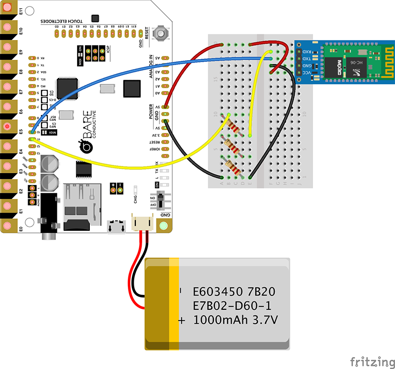

# Bluetooth-enabled Touch Board

The [Bare Condcutive Touch Board](http://www.bareconductive.com/shop/touch-board/) is an Arduino compatible board that includes an MP3 player. 

Wire an HC06 Bluetooth board to the Touch Board, load the Arduino sketch, pair the board with your Android device and use the [Android BlueTerm app](https://play.google.com/store/apps/details?id=es.pymasde.blueterm&hl=en_GB) to send via serial. The sketch will play the corresponding MP3 tracks when 1 to 9 is entered on the Android.

Project documented using [Fritzing](http://fritzing.org/home/)